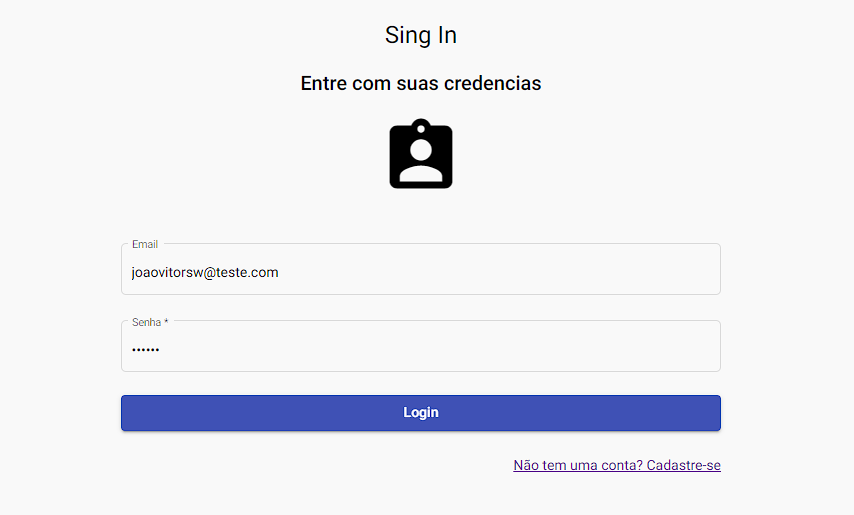
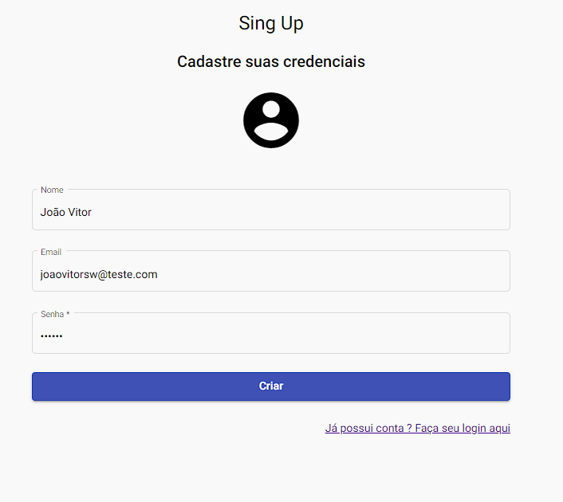
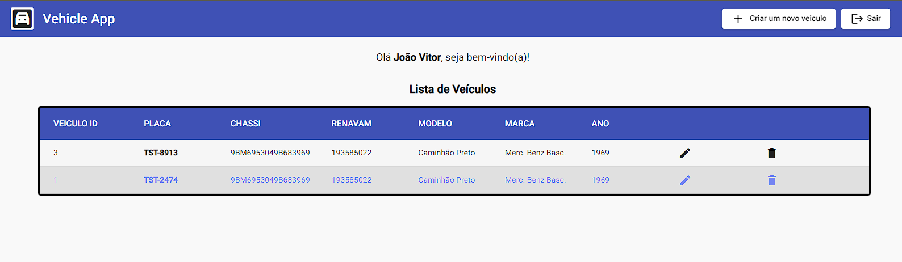

  
  [Portuguese](README.md)
  

 
 

 
  
     
    
     
   

 <a href="#eye_speech_bubble-visualizar">Visualizar</a> •
 <a href="#hammer_and_wrench-tecnologias">Tecnologias</a> • 
 <a href="#brain-conceitos-aplicados">Conceitos</a> •
 <a href="#boy-autor">Autor</a> •
 <a href="#balance_scale-licença">Licença</a>

---

## :eye_speech_bubble: **Visualizar**

Deploy do front-end efetuado no [HEROKU](https://dashboard.heroku.com) para visualizar: [Clique Aqui](https://crud-info-api.herokuapp.com/)

|                              :computer:Desktop                               |                               :iphone: Mobile                               |
| :--------------------------------------------------------------------------: | :-------------------------------------------------------------------------: |
|  <kbd></kbd>   | <kbd></kbd> |
| <kbd></kbd> | <kbd></kbd> |
| <kbd></kbd>  | <kbd></kbd> |

  
---
## :information_source: _Sobre_

Aplicação feita utilizando [Nx](https://nx.dev/), [Nest](https://nestjs.com/) ,[Angular](https://angular.io/) para criação de um crud de veiculos

---

## Servidor de desenvolvimento

Execute `ng serve my-app` para um servidor dev. Navegue até http://localhost:4200/. O aplicativo será recarregado automaticamente se você alterar qualquer um dos arquivos de origem.

## Build

Execute `ng build my-app` para compilar o projeto. Os artefatos de construção serão armazenados no diretório `dist/`. Use o sinalizador `--prod` para uma compilação de produção.

## Executando testes de unidade

Execute `ng test my-app` para executar os testes de unidade via [Jest](https://jestjs.io).

Execute `nx affected:test` para executar os testes de unidade afetados por uma alteração.

## Executando testes de ponta a ponta

Execute `ng e2e my-app` para executar os testes de ponta a ponta via [Cypress](https://www.cypress.io).

Execute `nx affected:e2e` para executar os testes de ponta a ponta afetados por uma alteração.

## :hammer_and_wrench: _Tecnologias_

|         :globe_with_meridians: FrontEnd          |     :globe_with_meridians: Backend      |
| :----------------------------------------------: | :-------------------------------------: |
|    [HTML 5](https://www.w3schools.com/html/)     |       [Nest](https://nestjs.com/)       |
|          [SCSS](https://sass-lang.com/)          |      [Prisma](https://nestjs.com/)      |
|  [TypeScript](https://www.typescriptlang.org/)   | [Postgres](https://www.postgresql.org/) |
|          [Angular](https://angular.io/)          | [Express](https://expressjs.com/pt-br/) |
| [Angular Material](https://material.angular.io/) |     [Node](https://nodejs.org/en/)      |

---

## :brain: _Conceitos Aplicados_

|       :page_facing_up:       |
| :--------------------------: |
|         Mobile First         |
|         Media Query          |
|     Conventional Commits     |
|    Testes Unitários e E2E    |
|      Clean Code e SOLID      |
|       Design Patterns        |
|  Dynamic Template Rendering  |
|        API Consuming         |
| Progressive Web Application  |
|             RXJS             |
|     Observable Operators     |
|        Atomic Commit         |
|        HTTP Requests         |
|    Async/Await Operators     |
|        Domain Modules        |
|      JwT Authentication      |
|          HTTP REST           |
|          Prisma ORM          |
|      LazyLoading Module      |
|      Prisma Migrations       |
|        Prisma Client         |
|        Prisma Schema         |
| Nest Global Pipe Validation  |
| Postgres Database Connection |
|   Program Oriented Objects   |
|       Injection Tokens       |

---

## :boy: _Autor_

<a href="https://github.com/Joaovitorsw">
 
  
 <b>Joaovitorsw</b>
</a>

Desenvolvido com ❤️ por Joaovitorsw Meus Contatos!

---

## :balance_scale: _Licença_

Copyright ©️ 2021 [Joaovitorsw](https://github.com/Joaovitorsw). 
This project is licensed by [MIT](./LICENSE).

---
